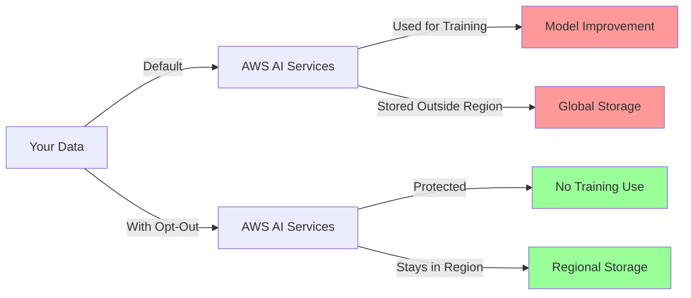

# Protecting Your Data: A Developer's Guide to AWS AI Opt-Out Policies

*Last updated: July 23, 2025*

> **📌 Service Update**: As of April 2024, Amazon CodeWhisperer has been fully discontinued and merged into Amazon Q Developer. This means CodeWhisperer is no longer available as a standalone service, and all functionality has transitioned to Q Developer. If you're looking for CodeWhisperer opt-out instructions, see the expanded Q Developer section below. Note: Always review the latest AWS Service Terms for changes, as policies evolve.

## TL;DR

AWS AI services use your data to improve their models by default. To opt out:
1. Enable AI opt-out policies in AWS Organizations
2. Apply the `"default": "optOut"` policy to your root
3. For enterprise: Use Control Tower + custom automation (LZA doesn't natively support this yet—as of July 2025, GitHub issue #107 remains open)
4. Verify with the provided Python script

**Time required**: 15 minutes (manual) or automated with IaC



---

If you're using AWS AI services like Transcribe, Polly, or Rekognition, there's something you should know: by default, AWS may use your data to improve their AI models. This includes storing your data outside your chosen region and using it for service development.

While this helps AWS improve their services, it might not align with your organization's data privacy requirements or compliance needs. The good news? You can opt out. The not-so-good news? The process isn't as straightforward as flipping a switch.

In this guide, I'll walk you through exactly how to opt out, with practical examples you can implement today.

All code examples, scripts, and templates from this guide are available in the GitHub repository: [https://github.com/nihe/aws-ai-optout-guide](https://github.com/nihe/aws-ai-optout-guide). Clone it for easy access and contributions!

## Table of Contents
- [Protecting Your Data: A Developer's Guide to AWS AI Opt-Out Policies](#protecting-your-data-a-developers-guide-to-aws-ai-opt-out-policies)
  - [TL;DR](#tldr)
  - [Table of Contents](#table-of-contents)
  - [Which Services Are Affected?](#which-services-are-affected)
    - [Services with Better Privacy (No Opt-Out Needed)](#services-with-better-privacy-no-opt-out-needed)
  - [Understanding the Implications](#understanding-the-implications)
    - [What AWS Can Do (If You Don't Opt Out)](#what-aws-can-do-if-you-dont-opt-out)
    - [What Happens When You Opt Out](#what-happens-when-you-opt-out)
    - [The Privacy Evolution at AWS](#the-privacy-evolution-at-aws)
  - [Four Implementation Methods](#four-implementation-methods)
    - [🤔 Which Method Should You Use?](#-which-method-should-you-use)
    - [Method 1: AWS Organizations Opt-Out](#method-1-aws-organizations-opt-out)
      - [Step 1: Enable AI Opt-Out Policies](#step-1-enable-ai-opt-out-policies)
      - [Step 2: Create the Opt-Out Policy](#step-2-create-the-opt-out-policy)
      - [Step 3: Apply the Policy](#step-3-apply-the-policy)
    - [Method 2: Enterprise-Scale Implementation](#method-2-enterprise-scale-implementation)
      - [Using AWS Control Tower + Landing Zone Accelerator (LZA)](#using-aws-control-tower--landing-zone-accelerator-lza)
    - [Method 3: Infrastructure as Code Solutions](#method-3-infrastructure-as-code-solutions)
      - [Terraform](#terraform)
      - [CloudFormation](#cloudformation)
      - [AWS CDK (Python)](#aws-cdk-python)
    - [Method 4: Additional Protections](#method-4-additional-protections)
      - [Opt Out of Q Developer Data Collection](#opt-out-of-q-developer-data-collection)
      - [Protect Your Public Websites](#protect-your-public-websites)
  - [Alignment with AWS Well-Architected Framework](#alignment-with-aws-well-architected-framework)
  - [Verifying Your Opt-Out](#verifying-your-opt-out)
    - [Check Policy Status](#check-policy-status)
    - [Create a Verification Script](#create-a-verification-script)
  - [Common Issues and Troubleshooting](#common-issues-and-troubleshooting)
    - [Issue 1: "Policy type not enabled" Error](#issue-1-policy-type-not-enabled-error)
    - [Issue 2: Policy Not Taking Effect](#issue-2-policy-not-taking-effect)
    - [Issue 3: Service Behavior Changes](#issue-3-service-behavior-changes)
  - [Common Mistakes to Avoid](#common-mistakes-to-avoid)
    - [❌ Don't Make These Errors](#-dont-make-these-errors)
  - [Monitoring and Governance](#monitoring-and-governance)
    - [Setting Up Continuous Compliance](#setting-up-continuous-compliance)
  - [Compliance Checklist](#compliance-checklist)
    - [For All Organizations](#for-all-organizations)
    - [For Regulated Industries](#for-regulated-industries)
  - [FAQ](#faq)
  - [Key Takeaways](#key-takeaways)
  - [Next Steps](#next-steps)
  - [Resources and References](#resources-and-references)
    - [Official AWS Documentation](#official-aws-documentation)
    - [Community Resources](#community-resources)
    - [Tools and Scripts](#tools-and-scripts)
  - [Contributing](#contributing)
  - [Acknowledgments](#acknowledgments)

## Which Services Are Affected?

According to AWS Service Terms Section 50.3 (as of July 2025), the following services may use your data for improvement by default:

- **Amazon CodeGuru Profiler** - Code performance analysis
- **Amazon Comprehend** - Natural language processing
- **Amazon Lex** - Conversational interfaces (chatbots)
- **Amazon Polly** - Text-to-speech
- **Amazon Rekognition** - Image and video analysis
- **Amazon Textract** - Document text extraction
- **Amazon Transcribe** - Speech-to-text
- **Amazon Translate** - Language translation
- **AWS Transform** - Agentic AI for enterprise workload modernization (announced May 2025)
- **Kiro (Preview)** - AI IDE for developer productivity (announced July 2025, public preview)

> **Note**: Amazon CodeWhisperer, which was previously on this list, has been fully discontinued and merged into Amazon Q Developer as of April 2024. Q Developer has different privacy policies—see below for details.

### Services with Better Privacy (No Opt-Out Needed)

Good news! These newer services don't use your data for training by default:
- **Amazon Bedrock** - Explicitly states data isn't used for model training
- **Amazon SageMaker** - Your training data stays yours
- **Amazon Q Developer Pro** - Enhanced privacy controls with no data used for service improvement
- **Amazon Q Business** - Enterprise features with privacy protections

> **Important**: While Q Developer Pro doesn't use your data for training, the free tier of Q Developer may still collect anonymized usage data and suggestions for service improvement. Check your tier! For opt-out in the Free Tier, disable telemetry settings in your IDE (details in Method 4).

## Understanding the Implications

Before we dive into the technical details, let's understand what this means:

### What AWS Can Do (If You Don't Opt Out)
- Use your API inputs/outputs to improve their services
- Store your data outside your chosen AWS region
- Retain data for service improvement purposes
- Apply this to both current and future AI services

### What Happens When You Opt Out
- AWS stops using your NEW data immediately
- Historical data used for improvement is deleted
- Your services continue working normally
- No performance impact

### The Privacy Evolution at AWS

AWS has been moving toward privacy-first designs in newer services:
- **Older services (2017-2020)**: Default to using customer data (opt-out available)
- **Newer services (2023+)**: Privacy by design, no data used for training
- **Transition period**: Some services like CodeWhisperer have been merged into newer, more privacy-conscious services. Recent additions like AWS Transform (May 2025) and Kiro (Preview, July 2025) follow the opt-out model for data usage.

> **Pro Tip**: Periodically review the AWS Service Terms (https://aws.amazon.com/service-terms/) for updates, as new services may be added.

## Four Implementation Methods

### 🤔 Which Method Should You Use?

Choose based on your organization's size and needs:

| Your Situation | Recommended Method | Why? |
|----------------|-------------------|------|
| Single AWS account | Method 1: Manual AWS Organizations (includes creating org if needed) | Quick and simple |
| Multiple accounts with Control Tower + LZA | Method 2: Control Tower + Custom Automation | LZA doesn't natively support AI opt-out (GitHub issue #107 open as of July 2025) |
| Multiple accounts with standard Control Tower | Method 2: Control Tower + IaC | Good automation |
| Complex multi-account with existing IaC | Method 3: Terraform/CloudFormation | Integrates with existing tools |
| Individual developer account | Method 1 + Method 4 | Cover all bases |

**Decision Tree**:
```
Start → Do you have multiple AWS accounts?
├─ No → Use Method 1 (Manual)
└─ Yes → Do you use Control Tower?
    ├─ No → Use Method 3 (IaC)
    └─ Yes → Do you use Landing Zone Accelerator?
        ├─ No → Use Method 2B (Control Tower + IaC)
        └─ Yes → Use Method 2C (LZA Custom Workaround)
```

> **Alternative for Non-LZA Users**: If you're not using LZA or Control Tower, stick to Method 1 or 3 for simplicity. For smaller teams, avoid custom Lambda functions—use the basic AWS CLI steps in Method 1 and verify manually.

### Method 1: AWS Organizations Opt-Out

This is the most comprehensive approach and works organization-wide.

> **Note for Single AWS Accounts**: AWS AI opt-out policies require an AWS Organization, even if you have only one account. Creating one is free, quick, and applies the policy directly to your account (which becomes the management account). There are no additional costs, and billing remains unchanged for single accounts. However, it enables consolidated billing (irrelevant until you add more accounts) and requires root user access for creation. If you're new to AWS, review the implications [here](https://docs.aws.amazon.com/organizations/latest/userguide/orgs_getting-started_create-org.html) before proceeding. If you prefer not to create an org, note that opt-out isn't possible—consider avoiding affected services or using privacy-first ones like Bedrock.

#### Step 1: Enable AI Opt-Out Policies

First, check if you have AWS Organizations enabled:

```bash
# Check if you have an organization
aws organizations describe-organization
```

> If this command fails (e.g., "You must sign in as the management account"), you don't have an organization yet—proceed to creation. Use root credentials for this step if using the console equivalent.

If not, create one:

```bash
# Create an organization (requires root user or IAM with organizations:CreateOrganization permission)
aws organizations create-organization --feature-set ALL
```

> 💡 **Pro Tip**: This command is safe for single accounts and has minimal impact (e.g., enables consolidated billing, but your bill doesn't change). Deletion is possible later if needed—see AWS docs for steps. For startups, this sets you up for future growth without upfront complexity.

Enable AI opt-out policies:

```bash
# Get your root ID
ROOT_ID=$(aws organizations list-roots --query 'Roots[0].Id' --output text)

# Enable AI opt-out policy type
aws organizations enable-policy-type \
    --root-id $ROOT_ID \
    --policy-type AISERVICES_OPT_OUT_POLICY
```

#### Step 2: Create the Opt-Out Policy

Create a file named `ai-opt-out-policy.json`:

```json
{
  "services": {
    "default": {
      "opt_out_policy": {
        "@@assign": "optOut"
      }
    }
  }
}
```

💡 **Pro tip**: Using `"default"` automatically includes all current and future AI services! This means you don't need to worry about new services or transitions (like CodeWhisperer → Q Developer, or additions like AWS Transform and Kiro).

#### Step 3: Apply the Policy

```bash
# Create the policy
POLICY_ID=$(aws organizations create-policy \
    --name "AI-OptOut-All-Services" \
    --description "Opt out of AI service data usage" \
    --type AISERVICES_OPT_OUT_POLICY \
    --content file://ai-opt-out-policy.json \
    --query 'Policy.PolicySummary.Id' \
    --output text)

# Attach to organization root
aws organizations attach-policy \
    --policy-id $POLICY_ID \
    --target-id $ROOT_ID
```

### Method 2: Enterprise-Scale Implementation

> ⚠️ **Important Update**: As of July 2025, AWS Landing Zone Accelerator does not natively support AI opt-out policies in its configuration. While this feature has been requested ([GitHub issue #107](https://github.com/awslabs/landing-zone-accelerator-on-aws/issues/107)), it's not yet implemented and the issue remains open. Use one of the workaround options below. Check the GitHub repo periodically for updates.

#### Using AWS Control Tower + Landing Zone Accelerator (LZA)

If you're managing multiple AWS accounts, you'll want to implement this policy at scale. Here are your options:

<details>
<summary><strong>🚀 Option A: Post-Deployment Automation (Recommended)</strong></summary>

Since LZA doesn't natively support AI opt-out policies, create a post-deployment automation:

**Step 1**: Add to your deployment pipeline after LZA:

```bash
#!/bin/bash
# post-lza-deployment.sh

echo "Applying AI opt-out policies..."

# Enable policy type
ROOT_ID=$(aws organizations list-roots --query 'Roots[0].Id' --output text)
aws organizations enable-policy-type \
    --root-id $ROOT_ID \
    --policy-type AISERVICES_OPT_OUT_POLICY

# Create and attach policy
POLICY_ID=$(aws organizations create-policy \
    --name "AI-OptOut-All-Services" \
    --description "Opt out of AI service data usage" \
    --type AISERVICES_OPT_OUT_POLICY \
    --content file://ai-opt-out-policy.json \
    --query 'Policy.PolicySummary.Id' \
    --output text)

aws organizations attach-policy \
    --policy-id $POLICY_ID \
    --target-id $ROOT_ID

echo "AI opt-out policies applied successfully"
```

**Step 2**: Add to your pipeline:
- Include this script in your CI/CD pipeline
- Run after each LZA deployment
- Monitor for success/failure

</details>

<details>
<summary><strong>🏗️ Option B: LZA Custom CloudFormation Workaround</strong></summary>

Use LZA's customization capabilities to deploy AI opt-out as a custom stack. Note: This involves a Lambda function for enabling the policy type—it's more advanced, but here's a breakdown: The Lambda handles enabling the policy if not already done, using Organizations APIs. For simpler setups, skip this and use Option A.

**Step 1**: Create `custom-cfn/ai-opt-out-policy.yaml`:

```yaml
AWSTemplateFormatVersion: '2010-09-09'
Description: 'Enable and configure AI Services Opt-Out Policy'

Resources:
  # Custom resource to enable policy type
  EnableAIOptOutPolicyType:
    Type: Custom::EnablePolicyType
    Properties:
      ServiceToken: !GetAtt EnablePolicyFunction.Arn
      PolicyType: AISERVICES_OPT_OUT_POLICY

  # Lambda function to enable policy type
  EnablePolicyFunction:
    Type: AWS::Lambda::Function
    Properties:
      FunctionName: EnableAIOptOutPolicyType
      Runtime: python3.9
      Handler: index.handler
      Role: !GetAtt LambdaRole.Arn
      Code:
        ZipFile: |
          import boto3
          import cfnresponse
          
          def handler(event, context):
              try:
                  if event['RequestType'] == 'Delete':
                      cfnresponse.send(event, context, cfnresponse.SUCCESS, {})
                      return
                  
                  org = boto3.client('organizations')
                  roots = org.list_roots()['Roots']
                  root_id = roots[0]['Id']
                  
                  # Enable AI opt-out policy type
                  try:
                      org.enable_policy_type(
                          RootId=root_id,
                          PolicyType='AISERVICES_OPT_OUT_POLICY'
                      )
                  except org.exceptions.PolicyTypeAlreadyEnabledException:
                      pass  # Already enabled
                  
                  cfnresponse.send(event, context, cfnresponse.SUCCESS, {})
              except Exception as e:
                  print(f"Error: {str(e)}")
                  cfnresponse.send(event, context, cfnresponse.FAILED, {})

  # Lambda execution role
  LambdaRole:
    Type: AWS::IAM::Role
    Properties:
      AssumeRolePolicyDocument:
        Version: '2012-10-17'
        Statement:
          - Effect: Allow
            Principal:
              Service: lambda.amazonaws.com
            Action: sts:AssumeRole
      ManagedPolicyArns:
        - arn:aws:iam::aws:policy/service-role/AWSLambdaBasicExecutionRole
      Policies:
        - PolicyName: OrganizationsPolicy
          PolicyDocument:
            Version: '2012-10-17'
            Statement:
              - Effect: Allow
                Action:
                  - organizations:EnablePolicyType
                  - organizations:ListRoots
                  - organizations:CreatePolicy
                  - organizations:AttachPolicy
                Resource: '*'

  # AI Opt-Out Policy
  AIOptOutPolicy:
    Type: AWS::Organizations::Policy
    DependsOn: EnableAIOptOutPolicyType
    Properties:
      Name: AIServicesOptOut
      Description: Opt out of AI service data usage
      Type: AISERVICES_OPT_OUT_POLICY
      Content: |
        {
          "services": {
            "default": {
              "opt_out_policy": {
                "@@assign": "optOut"
              }
            }
          }
        }
      TargetIds:
        - !Sub '${AWS::AccountId}'
```

**Step 2**: Add to your `customizations-config.yaml`:

```yaml
customizations:
  cloudFormationStacks:
    - deploymentTargets:
        organizationalUnits:
          - Root
      name: AIOptOutPolicy
      regions:
        - us-east-1  # Deploy only in one region
      template: custom-cfn/ai-opt-out-policy.yaml
      terminationProtection: true
```

**Step 3**: Commit and deploy:
```bash
git add customizations-config.yaml custom-cfn/ai-opt-out-policy.yaml
git commit -m "Add AI opt-out policy via custom CloudFormation"
git push

# Trigger LZA pipeline
```

</details>

<details>
<summary><strong>🏗️ Option C: Standard AWS Control Tower</strong></summary>

Control Tower doesn't enforce AI opt-out policies by default, but you can add them. For simpler alternatives without LZA, use the manual console approach or StackSets below:

1. **Manual Approach**: Create the policy in AWS Organizations console
2. **Automated Approach**: Use Account Factory for Terraform (AFT) or CloudFormation StackSets
3. **Customization**: Add to your Control Tower customizations

**Example using CloudFormation StackSet** (simpler than Lambda-heavy options):
```yaml
Resources:
  AIOptOutPolicy:
    Type: AWS::Organizations::Policy
    Properties:
      Name: AIServicesOptOut
      Type: AISERVICES_OPT_OUT_POLICY
      Content:
        services:
          default:
            opt_out_policy:
              '@@assign': optOut
      TargetIds:
        - !Ref AWS::OrganizationRoot
```

</details>

### Method 3: Infrastructure as Code Solutions

#### Terraform

```hcl
# Enable AWS Organizations
resource "aws_organizations_organization" "org" {
  feature_set = "ALL"
}

# Enable AI opt-out policy type
resource "aws_organizations_policy" "ai_opt_out" {
  name        = "AI-OptOut-All-Services"
  description = "Opt out of AI service data usage"
  type        = "AISERVICES_OPT_OUT_POLICY"

  content = jsonencode({
    services = {
      default = {
        opt_out_policy = {
          "@@assign" = "optOut"
        }
      }
    }
  })
}

# Attach to organization root
resource "aws_organizations_policy_attachment" "ai_opt_out" {
  policy_id = aws_organizations_policy.ai_opt_out.id
  target_id = aws_organizations_organization.org.roots[0].id
}
```

#### CloudFormation

```yaml
AWSTemplateFormatVersion: '2010-09-09'
Description: 'AWS AI Services Opt-Out Policy'

Resources:
  AIOptOutPolicy:
    Type: AWS::Organizations::Policy
    Properties:
      Name: AI-OptOut-All-Services
      Description: Opt out of AI service data usage
      Type: AISERVICES_OPT_OUT_POLICY
      Content:
        services:
          default:
            opt_out_policy:
              "@@assign": "optOut"
      TargetIds:
        - !GetAtt Organization.RootId

  Organization:
    Type: AWS::Organizations::Organization
    Properties:
      FeatureSet: ALL
```

#### AWS CDK (Python)

```python
from aws_cdk import Stack
from aws_cdk.aws_organizations import CfnPolicy, CfnOrganization
from constructs import Construct

class AIOptOutStack(Stack):
    def __init__(self, scope: Construct, construct_id: str, **kwargs) -> None:
        super().__init__(scope, construct_id, **kwargs)

        # Create the organization (assumes it doesn't exist; for existing orgs, pass root_id as a prop)
        org = CfnOrganization(self, "Organization", feature_set="ALL")

        # Create the opt-out policy
        ai_opt_out_policy = CfnPolicy(self, "AIOptOutPolicy",
            name="AI-OptOut-All-Services",
            description="Opt out of AI service data usage",
            type="AISERVICES_OPT_OUT_POLICY",
            content={
                "services": {
                    "default": {
                        "opt_out_policy": {
                            "@@assign": "optOut"
                        }
                    }
                }
            },
            target_ids=[org.attr_root_id]
        )
```

> **Interactive Demo**: Try this CDK example in the AWS CDK Playground (https://cdkworkshop.com/) for a hands-on preview. All scripts are available in this GitHub repo: [https://github.com/nihe/aws-ai-optout-guide](https://github.com/nihe/aws-ai-optout-guide) – clone it for easy setup!

### Method 4: Additional Protections

#### Opt Out of Q Developer Data Collection

Since CodeWhisperer is now fully part of Q Developer (discontinued as standalone in April 2024), here's how to control data collection. Amazon Q Developer privacy varies by tier:

- **Q Developer Pro**: Privacy by default—no data (including suggestions, code, or usage metrics) is used for service improvement or training. No opt-out needed. (See docs: https://docs.aws.amazon.com/amazonq/latest/qdeveloper-ug/security_privacy.html)
- **Q Developer Free Tier**: May collect anonymized data like accepted suggestions and usage patterns for service improvement. To opt out, disable telemetry in your IDE settings.

For VS Code (Free Tier):
```json
// .vscode/settings.json
{
  "aws.q.shareContentWithAWS": false,
  "aws.telemetry": false
}
```

For JetBrains IDEs (Free Tier):
1. Go to Settings → Tools → AWS → Q
2. Uncheck "Share content with AWS"

> **Tier Check**: Log into the AWS Console > Amazon Q > Check your subscription. Upgrade to Pro for automatic privacy if needed. Note: Even in Free Tier, customer code isn't shared, but metrics might be—disable as above for full control.

#### Protect Your Public Websites

Add to your `robots.txt`:
```
# Block AWS AI crawlers
User-agent: Amazonbot
Disallow: /

# Block Bedrock Knowledge Base crawlers
User-agent: anthropic-ai
User-agent: Claude-Web
Disallow: /
```

## Alignment with AWS Well-Architected Framework

Implementing AI opt-out policies isn't just about privacy—it's an AWS best practice that supports your Well-Architected reviews:

<details>
<summary><strong>📘 Machine Learning Lens - MLSEC-01</strong></summary>

**Requirement**: "Implement data privacy and protection controls"

**How opt-out helps**:
- ✅ Prevents unauthorized data usage for model training
- ✅ Maintains data sovereignty
- ✅ Provides auditable compliance controls

**Action**: Reference this implementation in your ML workload reviews as evidence of MLSEC-01 compliance.

</details>

<details>
<summary><strong>🌐 Data Residency & Sovereignty</strong></summary>

**How opt-out helps**:
- ✅ Prevents data movement for AI training
- ✅ Complements SCPs for complete data control
- ✅ Supports GDPR, CCPA, and other regulations

**Action**: Include both SCPs and AI opt-out policies in your data residency documentation.

</details>

<details>
<summary><strong>🔒 Security Pillar - Data Protection</strong></summary>

Supports three key Security Pillar questions:
- **SEC04**: Detection (prevents data exfiltration via AI training)
- **SEC08**: Data at rest (controls storage location)
- **SEC09**: Data in transit (limits processing locations)

**Action**: Add AI opt-out verification to your security runbooks.

</details>

## Verifying Your Opt-Out

Trust, but verify! Here's how to confirm your opt-out is working:

### Check Policy Status

```bash
# Verify AI opt-out is enabled
aws organizations describe-organization \
    --query 'Organization.AvailablePolicyTypes[?Type==`AISERVICES_OPT_OUT_POLICY`].Status' \
    --output text

# List all AI opt-out policies
aws organizations list-policies \
    --filter AISERVICES_OPT_OUT_POLICY

# Check effective policy for an account
aws organizations describe-effective-policy \
    --policy-type AISERVICES_OPT_OUT_POLICY \
    --target-id <ACCOUNT_ID>
```

### Create a Verification Script

```python
#!/usr/bin/env python3
import boto3
import json
from datetime import datetime

def verify_ai_opt_out():
    """Verify AI opt-out policies are properly configured"""
    org_client = boto3.client('organizations')
    
    # Check if org exists and AI opt-out is enabled
    try:
        org = org_client.describe_organization()
        print(f"✅ Organization found: {org['Organization']['Id']}")
        
        # Check if AI opt-out policy type is enabled
        policy_types = org['Organization']['AvailablePolicyTypes']
        ai_opt_out_enabled = any(
            pt['Type'] == 'AISERVICES_OPT_OUT_POLICY' and pt['Status'] == 'ENABLED'
            for pt in policy_types
        )
        
        if ai_opt_out_enabled:
            print("✅ AI opt-out policy type is ENABLED")
        else:
            print("❌ AI opt-out policy type is NOT enabled")
            return False
            
        # List all AI opt-out policies
        policies = org_client.list_policies(Filter='AISERVICES_OPT_OUT_POLICY')
        print(f"\n📋 Found {len(policies['Policies'])} AI opt-out policies:")
        
        for policy in policies['Policies']:
            print(f"  - {policy['Name']} (ID: {policy['Id']})")
            
            # Check policy content
            policy_detail = org_client.describe_policy(PolicyId=policy['Id'])
            content = json.loads(policy_detail['Policy']['Content'])
            
            if 'default' in content.get('services', {}):
                print("    ✅ Policy includes 'default' (all services)")
            else:
                print("    ⚠️  Policy doesn't include 'default' service")
                
        # Check all accounts
        print("\n🏢 Checking accounts:")
        accounts = org_client.list_accounts()
        
        for account in accounts['Accounts']:
            if account['Status'] == 'ACTIVE':
                try:
                    effective = org_client.describe_effective_policy(
                        PolicyType='AISERVICES_OPT_OUT_POLICY',
                        TargetId=account['Id']
                    )
                    
                    if effective['EffectivePolicy']:
                        print(f"  ✅ {account['Name']} - Opt-out policy active")
                    else:
                        print(f"  ❌ {account['Name']} - No opt-out policy")
                except Exception as e:
                    print(f"  ⚠️  {account['Name']} - Error checking: {str(e)}")
                    
        return True
        
    except Exception as e:
        print(f"❌ Error: {str(e)}")
        return False

if __name__ == "__main__":
    print(f"🔍 AWS AI Opt-Out Verification Tool")
    print(f"📅 Run date: {datetime.now().strftime('%Y-%m-%d %H:%M:%S')}\n")
    
    if verify_ai_opt_out():
        print("\n✅ AI opt-out verification completed successfully!")
    else:
        print("\n❌ AI opt-out verification failed - action required!")
```

## Common Issues and Troubleshooting

### Issue 1: "Policy type not enabled" Error

**Solution**: Enable the policy type first:
```bash
aws organizations enable-policy-type \
    --root-id $(aws organizations list-roots --query 'Roots[0].Id' --output text) \
    --policy-type AISERVICES_OPT_OUT_POLICY
```

### Issue 2: Policy Not Taking Effect

**Possible causes**:
1. Policy not attached at the right level
2. Conflicting policies at lower levels
3. Policy syntax errors

**Debug steps**:
```bash
# Check effective policy
aws organizations describe-effective-policy \
    --policy-type AISERVICES_OPT_OUT_POLICY \
    --target-id <ACCOUNT_ID>

# Validate policy syntax
aws organizations validate-policy-content \
    --policy-type AISERVICES_OPT_OUT_POLICY \
    --policy-document file://ai-opt-out-policy.json
```

### Issue 3: Service Behavior Changes

Some users report services behaving differently after opt-out. While AWS states there should be no impact, if you experience issues:
1. Document the specific behavior change
2. Contact AWS Support with details
3. Consider service-specific opt-out instead of global

## Common Mistakes to Avoid

### ❌ Don't Make These Errors

1. **Using SCPs instead of AI opt-out policies**
   - SCPs control access, not data usage
   - You need the specific `AISERVICES_OPT_OUT_POLICY` type

2. **Forgetting the @@ operators**
   ```json
   // Wrong
   "opt_out_policy": "optOut"
   
   // Correct
   "opt_out_policy": {
     "@@assign": "optOut"
   }
   ```

3. **Not using "default" service**
   - Listing individual services means missing future ones
   - Always include "default" for comprehensive coverage

4. **Applying to wrong OU level**
   - Apply to Root for organization-wide coverage
   - Applying to specific OUs may miss accounts

5. **Not verifying after implementation**
   - Always run the verification script
   - Check effective policy for all accounts

## Monitoring and Governance

### Setting Up Continuous Compliance

<details>
<summary><strong>🔍 AWS Config Rule for AI Opt-Out</strong></summary>

Create a custom AWS Config rule to monitor opt-out policy compliance:

```python
import json
import boto3

def lambda_handler(event, context):
    org_client = boto3.client('organizations')
    config_client = boto3.client('config')
    
    # Check if AI opt-out is enabled
    try:
        policies = org_client.list_policies(Filter='AISERVICES_OPT_OUT_POLICY')
        
        if not policies['Policies']:
            return {
                'compliance_type': 'NON_COMPLIANT',
                'annotation': 'No AI opt-out policy found'
            }
        
        # Check if applied to root
        for policy in policies['Policies']:
            targets = org_client.list_targets_for_policy(PolicyId=policy['Id'])
            if any(t['Type'] == 'ROOT' for t in targets['Targets']):
                return {
                    'compliance_type': 'COMPLIANT',
                    'annotation': 'AI opt-out policy properly configured'
                }
        
        return {
            'compliance_type': 'NON_COMPLIANT',
            'annotation': 'AI opt-out policy not attached to root'
        }
        
    except Exception as e:
        return {
            'compliance_type': 'NON_COMPLIANT',
            'annotation': f'Error checking policy: {str(e)}'
        }
```

</details>

<details>
<summary><strong>📊 CloudWatch Dashboard</strong></summary>

Monitor your AI service usage to ensure opt-out is working:

```json
{
  "widgets": [
    {
      "type": "metric",
      "properties": {
        "metrics": [
          ["AWS/Rekognition", "SuccessfulImageCount"],
          ["AWS/Transcribe", "SuccessfulTranscriptionCount"],
          ["AWS/Comprehend", "SuccessfulRequestCount"]
        ],
        "period": 300,
        "stat": "Sum",
        "region": "us-east-1",
        "title": "AI Service Usage (Should show normal usage)"
      }
    }
  ]
}
```

Usage should remain normal after opt-out - if it drops to zero, something's wrong!

</details>

## Compliance Checklist

### For All Organizations

Use this checklist for audits and compliance reviews:

- [x] AWS Organizations is enabled
- [x] AI opt-out policy type is enabled
- [x] Opt-out policy includes "default" service
- [x] Policy is attached to organization root
- [x] All active accounts show opt-out in effective policy
- [x] Q Developer telemetry is disabled (if using free tier)
- [x] Robots.txt blocks AWS crawlers (for public sites)
- [x] Data handling disclosure updated for users
- [x] Opt-out verification script runs successfully
- [x] Documentation of opt-out date maintained
- [x] Team informed about CodeWhisperer → Q Developer transition
- [x] Well-Architected review includes ML Lens MLSEC-01 compliance

### For Regulated Industries

<details>
<summary><strong>🏥 Healthcare (HIPAA/HITECH)</strong></summary>

Additional requirements:
- [x] BAA covers all AI services in use
- [x] PHI is not processed through non-BAA services
- [x] Audit logs show no data usage for training
- [x] Data residency controls are implemented
- [x] Incident response plan includes AI data exposure

</details>

<details>
<summary><strong>💳 Financial Services (PCI-DSS/SOX)</strong></summary>

Additional requirements:
- [x] Cardholder data never processed through AI services
- [x] Financial forecasting models exclude training data sharing
- [x] Audit trail includes opt-out policy changes
- [x] Quarterly reviews of AI service usage

</details>

<details>
<summary><strong>🇪🇺 GDPR Compliance</strong></summary>

Additional requirements:
- [x] Data Processing Agreements updated
- [x] Privacy Impact Assessment includes AI opt-out
- [x] Right to erasure procedures include AI training data
- [x] Cross-border transfer documentation updated
- [x] Opt-out included in Records of Processing Activities

</details>

## FAQ

**Q: Where is CodeWhisperer? I can't find it in my IDE anymore.**
A: CodeWhisperer was fully discontinued in April 2024 and merged into Amazon Q Developer. Install the Q Developer extension instead. All prior features are now in Q, but with updated privacy—check your tier.

**Q: Do I need to opt out of Q Developer?**
A: It depends on your tier:
- Q Developer Pro: No opt-out needed (privacy by default; no data used for improvement).
- Q Developer Free: Yes, disable telemetry as per Method 4 to prevent anonymized data collection for service improvement.

**Q: Will my services work the same after opting out?**
A: Yes! Opting out only affects whether AWS uses your data for training. All functionality remains the same.

**Q: What about services not listed in Section 50.3?**
A: Services not listed (like Bedrock, SageMaker) typically don't use customer data for training by design.

**Q: Does opting out cost extra?**
A: No, there are no additional charges for opting out. It's a free privacy protection.

**Q: Can I opt out of specific services instead of all?**
A: Yes, you can specify individual services in your policy instead of using "default", but we recommend opting out of all for simplicity.

**Q: How long does it take for opt-out to take effect?**
A: New data is protected immediately. AWS states they'll delete historical data used for improvement, though the exact timeline isn't specified.

**Q: Why doesn't AWS Landing Zone Accelerator support AI opt-out policies natively?**
A: As of July 2025, this feature is not yet implemented in LZA. There's an open feature request ([issue #107](https://github.com/awslabs/landing-zone-accelerator-on-aws/issues/107)). Use the workarounds provided until native support is added.

## Key Takeaways

1. **Don't assume your data is private** - AWS AI services use data for improvement by default
2. **Newer services are better** - Bedrock and Q Developer Pro have privacy-first designs
3. **Use organization-wide policies** - More effective than account-by-account management
4. **Enterprise scale requires workarounds** - LZA doesn't natively support AI opt-out yet
5. **Align with frameworks** - Reference ML Lens MLSEC-01 for compliance
6. **Monitor continuously** - Set up Config rules and dashboards
7. **Stay informed** - AWS policies evolve, so review them periodically

## Next Steps

1. **Choose your implementation method** based on your organization size
2. **Implement the opt-out policy** using the code examples above (If single-account, create org first—it's free and essential)
3. **Run the verification script** to ensure it's working
4. **Set up monitoring** for continuous compliance
5. **Update your compliance documentation** with Well-Architected references
6. **Train your team** on the new policies and Q Developer transition
7. **Share this guide** with your security and compliance teams

Remember: opting out doesn't affect service functionality - it just ensures your data stays yours. With enterprise-scale automation, you can protect your entire organization with minimal effort.

## Resources and References

### Official AWS Documentation
- [AWS Organizations AI Opt-Out Policies](https://docs.aws.amazon.com/organizations/latest/userguide/orgs_manage_policies_ai-opt-out.html)
- [AWS Service Terms Section 50](https://aws.amazon.com/service-terms/)
- [ML Lens - Well-Architected Framework](https://docs.aws.amazon.com/wellarchitected/latest/machine-learning-lens/welcome.html)
- [Landing Zone Accelerator Documentation](https://aws.amazon.com/solutions/implementations/landing-zone-accelerator-on-aws/)
- [Amazon Q Developer Privacy](https://docs.aws.amazon.com/amazonq/latest/qdeveloper-ug/security_privacy.html)
- [AWS Transform Overview](https://aws.amazon.com/transform/)

### Community Resources
- [AWS Security Blog](https://aws.amazon.com/blogs/security/)
- [AWS Developer Forums](https://forums.aws.amazon.com/)
- [LZA GitHub Repository](https://github.com/awslabs/landing-zone-accelerator-on-aws)

### Tools and Scripts
- [Organization Policy Validator](https://github.com/aws-samples/aws-organization-policy-validator)
- [AWS Config Conformance Packs](https://docs.aws.amazon.com/config/latest/developerguide/conformance-packs.html)
- [GitHub Repo for This Guide](https://github.com/nihe/aws-ai-optout-guide) – Includes all scripts, templates, and a CDK demo setup.

## Contributing

Found an error or have an improvement? Please:
1. Leave a comment below
2. Submit a PR to our [GitHub repo](https://github.com/nihe/aws-ai-optout-guide)
3. Share your enterprise implementation stories

## Acknowledgments

Thanks to the AWS community members who contributed insights, especially regarding Control Tower and LZA implementations. Special thanks to those who shared their Well-Architected review experiences.

---

*Found this helpful? Have questions or improvements? Let me know in the comments below!*

**Tags**: #aws #privacy #security #ai #compliance #cloud #dataprotection #developertools #controltower #landingzone #wellarchitected

---
