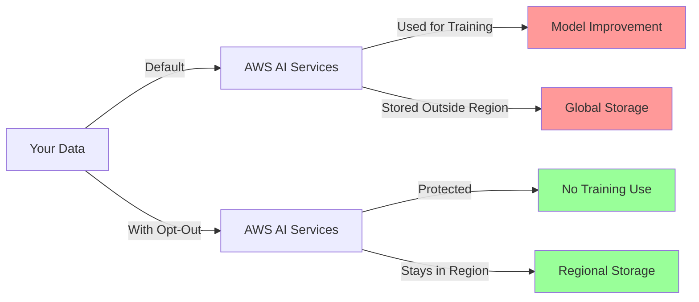
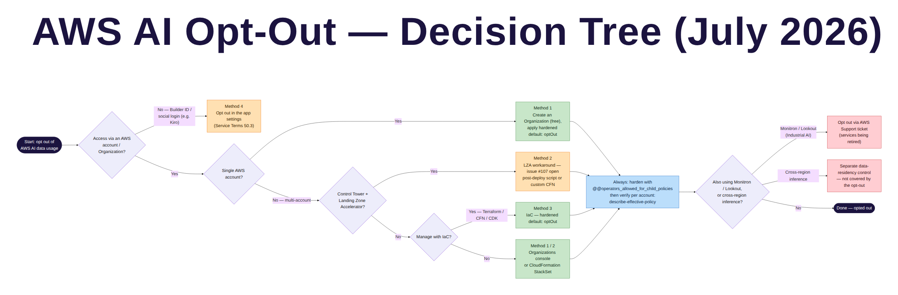

# Protecting Your Data: A Developer's Guide to AWS AI Opt-Out Policies

*Last updated: September 2026*

> **🔄 September 2026 check (2026-09-30)**: The supported-services list grew from 31 to **35 entries**. New since July: AWS Config, Amazon Bio Discovery, Amazon Connect Health (two entries: Operational Support and Model Training), Amazon Connect Talent, and Scenario Discovery. Section 50.3 is unchanged (the Service Terms were last updated 2026-09-15). LZA issue #107 is still open as of v1.16.3. The Q Developer → Kiro dates are unchanged. The `"default": "optOut"` policy covers the new services automatically, so no policy change is needed. A follow-up check against the AWS documentation added four notes: the new [AWS Settings opt-out](#alternative-opt-out-through-aws-settings-limited-release), the [Bedrock data retention modes](#services-with-better-privacy-no-opt-out-needed), the split between Security Hub and Security Hub CSPM, and the Connect policy keys that no longer appear on the list page.

> **📌 Major Update (July 2026) — One policy, thirty services**: A lot has changed since the last revision of this guide. The scope of the AI services opt-out policy has roughly **tripled** — the official list now counts **31 services** (verified 2026-07-21), including Amazon CloudWatch, GuardDuty, Security Hub, AWS Glue, and DMS. Amazon Q Developer (IDE plugins and CLI) is being **sunset in favor of Kiro** (end of support: April 30, 2027). And AWS has added an official opt-out path for Builder ID / social login users who don't have an AWS Organization. Details in the changelog below.

## What changed since July 2025

If you read the previous version of this guide, here's the delta:

1. **The opt-out policy now covers 35 services** (31 in July 2026; see the September check above). The official list has expanded far beyond the classic AI services. It now includes Amazon CloudWatch (ML functionality), Amazon GuardDuty, AWS Security Hub, Amazon Security Lake, AWS Glue, AWS Database Migration Service, Amazon WorkSpaces, the Amazon Connect family, Amazon Fraud Detector, AWS Supply Chain, Amazon Quick, AWS DevOps Agent, Amazon DataZone, and more. If your last review of this policy was in 2025, its blast radius has grown significantly — mostly in your favor.
2. **Section 50.3 was rewritten.** The list of services that use your data by default is now: CodeGuru Profiler, Comprehend, Lex, Polly, Rekognition, Textract, Transcribe, Translate, AWS Transform, AWS FinOps Agent (Preview), and — importantly, only — **Kiro Free Tier and Kiro individual subscribers**. Medical variants (Comprehend Medical, Transcribe Medical, HealthScribe) and Comprehend Detect PII are now explicitly excluded.
3. **There's finally an opt-out path without an AWS Organization.** Section 50.3 now explicitly states that for access via AWS Builder ID or a third-party authentication provider (GitHub, Google), you can opt out using the mechanism in the service documentation — i.e., in-app settings. The previous version of this guide said "no org, no opt-out." That's no longer true.
4. **Amazon Q Developer is being consolidated into Kiro.** The Q Developer CLI became the Kiro CLI in November 2025. New Q Developer signups were blocked on May 15, 2026, and the IDE plugins and paid subscriptions reach end of support on **April 30, 2027**. The privacy guidance in this article has been rewritten around Kiro.
5. **Amazon Connect feature-level opt-outs were discontinued on March 31, 2026** ([source](https://web.archive.org/web/20260701072537/https://docs.aws.amazon.com/connect/latest/adminguide/data-opt-out.html)). The Organizations policy is now the way to control Connect data usage.
6. **Amazon Monitron is a special case**: opt-out requires contacting AWS Support — the Organizations policy doesn't cover it (Service Terms Section 81, Industrial AI Services).
7. **LZA still doesn't support this natively.** GitHub issue #107 remains open as of September 2026 (re-verified against the `organization-config` source and the release notes through v1.16.3). The workarounds in this guide are still the way.

## TL;DR

AWS AI services use your data to improve their models by default. To opt out:

1. Enable AI opt-out policies in AWS Organizations
2. Apply the `"default": "optOut"` policy to your root — use the hardened variant with `@@operators_allowed_for_child_policies` to prevent member accounts from overriding it
3. For enterprise: Use Control Tower + custom automation (LZA doesn't natively support this — GitHub issue #107 is still open as of September 2026)
4. Developers on Kiro Free Tier or with an individual subscription (Builder ID / social login): disable content collection in the IDE/CLI settings — the Organizations policy doesn't reach you there
5. Verify with the provided Python script

**Time required**: 15 minutes (manual) or automated with IaC

---

If you're using AWS AI services like Transcribe, Polly, or Rekognition — or, as of 2026, security and ops services like GuardDuty and CloudWatch with ML features — there's something you should know: by default, AWS may use your data to improve their AI models and services. This can include storing your data outside your chosen region.

While this helps AWS improve their services, it might not align with your organization's data privacy requirements or compliance needs — especially under GDPR, NIS2, or sector-specific regulation. The good news? You can opt out. The not-so-good news? The process still isn't a single switch, and the surface area keeps growing.

In this guide, I'll walk you through exactly how to opt out, with practical examples you can implement today.

All code examples, scripts, and templates from this guide are available in the GitHub repository: <https://github.com/nihe/aws-ai-optout-guide>. Clone it for easy access and contributions!

## Table of Contents

- [What changed since July 2025](#what-changed-since-july-2025)
- [TL;DR](#tldr)
- [Which Services Are Affected?](#which-services-are-affected)
- [The Expanded Opt-Out Scope: Not Just "AI Services" Anymore](#the-expanded-opt-out-scope)
- [Services with Better Privacy (No Opt-Out Needed)](#services-with-better-privacy-no-opt-out-needed)
- [Understanding the Implications](#understanding-the-implications)
- [Four Implementation Methods](#four-implementation-methods)
- [Method 1: AWS Organizations Opt-Out](#method-1-aws-organizations-opt-out)
- [Method 2: Enterprise-Scale Implementation](#method-2-enterprise-scale-implementation)
- [Method 3: Infrastructure as Code Solutions](#method-3-infrastructure-as-code-solutions)
- [Method 4: Kiro, Builder ID, and Other Non-Org Opt-Outs](#method-4-kiro-builder-id-and-other-non-org-opt-outs)
- [Special Cases: Monitron and Amazon Connect](#special-cases-monitron-and-amazon-connect)
- [Alignment with AWS Well-Architected Framework](#alignment-with-aws-well-architected-framework)
- [Verifying Your Opt-Out](#verifying-your-opt-out)
- [Common Issues and Troubleshooting](#common-issues-and-troubleshooting)
- [Common Mistakes to Avoid](#common-mistakes-to-avoid)
- [Monitoring and Governance](#monitoring-and-governance)
- [Compliance Checklist](#compliance-checklist)
- [FAQ](#faq)
- [Key Takeaways](#key-takeaways)
- [Resources and References](#resources-and-references)

## Repository Contents

Everything referenced in this guide lives in this repository:

| Path | What it is |
|---|---|
| `templates/ai-opt-out-policy.json` | The hardened opt-out policy (child overrides locked). Used by the CLI and LZA scripts. |
| `templates/ai-opt-out-policy.yaml` | CloudFormation with a Lambda-backed custom resource that **enables the policy type** and creates the hardened policy. |
| `templates/cloudformation/ai-opt-out.yaml` | Minimal CloudFormation (assumes the policy type is already enabled). |
| `templates/terraform/main.tf` | Terraform for the hardened policy. |
| `templates/cdk/` | Complete AWS CDK (Python) app for an existing organization (`cdk deploy -c root_id=r-xxxx`). |
| `scripts/verify_ai_opt_out.py` | Fail-closed verification gate — validates the effective policy per account, exits non-zero on any failure. |
| `scripts/post-lza-deployment.sh` | Idempotent post-LZA deployment automation (Method 2, Option A). |
| `config/customizations-config.yaml` | LZA customizations snippet (Method 2, Option B). |
| `config/aws-config-rule.py` | Custom AWS Config rule (periodic) — publishes PutEvaluations; COMPLIANT only for a hardened root-attached optOut. |
| `config/cloudwatch-dashboard.json` | CloudWatch dashboard to confirm AI service usage stays normal after opt-out. |
| `tests/` | Regression tests for the policy validators (`pip install -r requirements-dev.txt && pytest tests/`). |
| `requirements-dev.txt` | Pinned test dependencies (boto3, pytest). |

All templates use the **hardened variant**: `@@operators_allowed_for_child_policies: ["@@none"]` locks the opt-out so no member account or child OU can override it.

## Which Services Are Affected?

According to AWS Service Terms Section 50.3 (re-verified September 2026), the following services may use your data ("AI Content") for service improvement — including model training — by default:

- **Amazon CodeGuru Profiler** — Code performance analysis
- **Amazon Comprehend** — Natural language processing
- **Amazon Lex** — Conversational interfaces (chatbots)
- **Amazon Polly** — Text-to-speech
- **Amazon Rekognition** — Image and video analysis
- **Amazon Textract** — Document text extraction
- **Amazon Transcribe** — Speech-to-text
- **Amazon Translate** — Language translation
- **AWS Transform** — Agentic AI for enterprise workload modernization
- **AWS FinOps Agent (Preview)** — Agentic cost optimization
- **Kiro Free Tier and Kiro individual subscribers** — AWS's agentic IDE/CLI (successor to Q Developer; see Method 4 for the important tier distinction)

Explicitly **excluded** from this default data usage (per Section 50.3): Amazon Comprehend Medical, Amazon Transcribe Medical, AWS HealthScribe, and Amazon Comprehend Detect PII. AWS carved the healthcare-adjacent variants out — a sensible move, and one less thing to worry about for HIPAA-adjacent workloads.

Separately, the **Industrial AI Services** (Service Terms Section 81) — Amazon Lookout for Vision, Amazon Lookout for Equipment, and Amazon Monitron — also use your data by default. But note: **AWS is winding this whole category down.** Monitron stopped taking new customers in October 2024; Lookout for Equipment stopped new customers on October 7, 2025 and reaches full end-of-availability on **October 7, 2026**; Lookout for Vision is on the same discontinuation path. None of the three currently appears on the [Organizations supported-services list](https://docs.aws.amazon.com/organizations/latest/userguide/orgs_manage_policies_ai-opt-out_all.html#ai-opt-out-all-list) — so for opt-out you're dealing with the AWS Support / service-specific path, not the org policy. If you still run any of these in production, treat the opt-out as a per-service action on your compliance checklist, and plan the migration off the service anyway.

> **Note**: Amazon CodeWhisperer was discontinued and merged into Amazon Q Developer in April 2024. Q Developer (IDE plugins and CLI) is now itself being sunset in favor of **Kiro**: new signups were blocked on May 15, 2026, and end of support is April 30, 2027. Q Developer inside the AWS Management Console, documentation site, mobile app, and Slack/Teams integrations continues unaffected.

## The Expanded Opt-Out Scope

Here's the structural change that matters most in 2026: the data-usage clauses are no longer concentrated in Section 50.3. AWS has embedded opt-out-policy references into individual service sections throughout the Service Terms (for example, Amazon CloudWatch ML functionality in Section 8.2) and into service documentation.

The result: the AWS Organizations documentation now lists **35 services** covered by the AI services opt-out policy (counted 2026-09-30; it was 30 when I started the July revision and 31 on 2026-07-21):

- **Observability, Ops & Governance**: Amazon CloudWatch (ML functionality), Amazon AI Operations, AWS DevOps Agent, AWS Config
- **Security**: Amazon GuardDuty, AWS Security Hub, Amazon Security Lake
- **Data & Integration**: AWS Glue, AWS Database Migration Service, Amazon DataZone (incl. SageMaker Data Agent), AWS Entity Resolution
- **Contact Center**: Amazon Connect Customer, Connect Decisions, Connect Health (Operational Support; Model Training), Connect Talent, Amazon Chime SDK voice analytics. Connect Customer Optimization and Contact Lens no longer appear as separate entries on the list page, but `connectoptimization` and `contactlens` are still valid service keys in the [policy syntax](https://docs.aws.amazon.com/organizations/latest/userguide/orgs_manage_policies_ai-opt-out_syntax.html) (38 keys in total, plus `default`). If you pinned either key in a child policy, it still works.
- **Business & End-User**: Amazon Quick (formerly QuickSight), AWS Supply Chain, Amazon WorkSpaces, Amazon Fraud Detector, AWS FinOps Agent
- **Industry & Science**: Amazon Bio Discovery, Scenario Discovery (AWS IoT SiteWise)
- **The classic AI services & developer tools**: Comprehend, Lex, Polly, Rekognition, Textract, Transcribe, Translate, CodeGuru Profiler, Amazon Q Developer, Amazon CodeWhisperer (listed separately, now part of Q Developer), AWS Transform

Two things follow from this:

**First**, the `"default": "optOut"` policy is more valuable than ever. Several of the security services (GuardDuty, Security Hub, Security Lake) state in their documentation that they don't *currently* collect content for service improvement — but the terms allow them to start, and the docs explicitly recommend opting out proactively. With a default opt-out at the root, you're covered before they flip that switch. AWS Config (new on the list) makes the same statement. One nuance for Security Hub: its opt-out page applies only to the enhanced **AWS Security Hub** launched on December 2, 2025. The original product is now called **AWS Security Hub CSPM**, and the data-use terms described there apply to CSPM customers only once they enable the enhanced Security Hub.

**Second**, if you did a one-time compliance review of "which AWS services can use our data" in 2024 or 2025, that review is stale. The list grows; your policy strategy should assume it will keep growing.

## Services with Better Privacy (No Opt-Out Needed)

These services don't use your content for training by default:

- **Amazon Bedrock** — Explicitly does not use your prompts or completions for model training. Bedrock is now formally listed as an "AI Service" in Section 50.1, but it is *not* in the Section 50.3 data-usage list. **Retention is a separate question**, though: see the caveat below.
- **Amazon SageMaker** — Your training data stays yours.
- **Kiro via IAM Identity Center / Kiro Enterprise** — No content used for service improvement; Enterprise tenants are automatically opted out of telemetry and content collection (see Method 4).

> **Bedrock data retention caveat (September 2026)**: "No training" is not the same as "no retention." Bedrock now has per-Region [data retention modes](https://docs.aws.amazon.com/bedrock/latest/userguide/data-retention.html), set at account or project level: `none` (zero data retention), `default` (the model's own retention policy applies; AWS may keep data for safety and abuse prevention), `aws_review` (AWS may keep inputs and outputs for **human review** within AWS), and a legacy `provider_data_share` that grants the same permission. In none of these modes does the model provider receive your content. Some models require `aws_review` as a condition of access (AWS names Claude Fable 5 and 5.1); if your effective mode is `none` or `default`, those models are unavailable. If you need guaranteed zero retention, set `data_retention_mode` to `none` in every Region you use (the setting doesn't propagate across Regions) and accept that `aws_review`-only models are off the table. This is a Bedrock setting, not part of the Organizations opt-out policy.

> **Cross-region inference caveat**: Service Terms Section 1.24 now lists ~25 services with embedded generative AI features powered by Bedrock (from Connect to GuardDuty to WorkSpaces). These features may use **cross-region inference** by default — your content isn't used for training, but it may be *processed* in a different AWS region for capacity reasons. If you have strict data residency requirements (and if you're reading this from the DACH region, you probably do), that's a separate control to review per service. Training opt-out and residency are related but distinct problems.

## Understanding the Implications

### Data flow: with and without opt-out


```mermaid
graph LR
    A[Your Data] -->|Default| B[AWS AI Services]
    B -->|Used for Training| C[Model Improvement]
    B -->|Stored Outside Region| D[Global Storage]

    A -->|With Opt-Out| E[AWS AI Services]
    E -->|Protected| F[No Training Use]
    E -->|Stays in Region| G[Regional Storage]

    style C fill:#ff9999
    style D fill:#ff9999
    style F fill:#99ff99
    style G fill:#99ff99
```


### What AWS Can Do (If You Don't Opt Out)

- Use your API inputs/outputs to improve their services, including model training
- Store your data outside your chosen AWS region for that purpose
- Retain data for service improvement purposes
- Apply this to both current and future AI services (the terms are written forward-compatibly)

### What Happens When You Opt Out

- AWS stops using your NEW data immediately
- Historical content stored for service improvement is deleted (content required to actually provide the service to you is not)
- Your services continue working normally
- No performance impact

### The Privacy Evolution at AWS

The trend since 2023 has been consistent: newer flagship services (Bedrock, SageMaker) are privacy-by-design, while the older AI services and the free/individual tiers of developer tools remain opt-out. What's new in 2025–2026 is that AWS has *widened* the opt-out mechanism to cover ops, security, and data services — which is good — while simultaneously launching new agentic services (Transform, FinOps Agent, Kiro's individual tiers) that default to data collection. The pattern to internalize: **enterprise/org-authenticated access tends to be private by default; individual/Builder-ID access tends to collect by default.**

> **Pro Tip**: Periodically review the AWS Service Terms (<https://aws.amazon.com/service-terms/>) and the [official list of supported services](https://docs.aws.amazon.com/organizations/latest/userguide/orgs_manage_policies_ai-opt-out_all.html#ai-opt-out-all-list). Both change multiple times a year now.

## Four Implementation Methods

### 🤔 Which Method Should You Use?

| Your Situation | Recommended Method | Why? |
| --- | --- | --- |
| Single AWS account | Method 1: AWS Organizations (create an org if needed) | Quick and simple |
| Multiple accounts with Control Tower + LZA | Method 2: Control Tower + Custom Automation | LZA still doesn't natively support AI opt-out (issue #107 open as of September 2026) |
| Multiple accounts with standard Control Tower | Method 2: Control Tower + IaC | Good automation |
| Complex multi-account with existing IaC | Method 3: Terraform/CloudFormation | Integrates with existing tools |
| Individual developer (Builder ID / social login, Kiro) | Method 4 | The Organizations policy doesn't reach Builder ID access — use in-app opt-outs |
| Individual developer with own AWS account | Method 1 + Method 4 | Cover both surfaces |



> **Alternative for Non-LZA Users**: If you're not using LZA or Control Tower, stick to Method 1 or 3 for simplicity. For smaller teams, avoid custom Lambda functions — use the basic AWS CLI steps in Method 1 and verify manually.

### Method 1: AWS Organizations Opt-Out

This is the most comprehensive approach and works organization-wide.

> **Note for Single AWS Accounts**: AWS AI opt-out policies require an AWS Organization, even with only one account. Creating one is free and quick, and the policy applies directly to your account (which becomes the management account). Billing is unchanged for single accounts. If you access AI tooling *without* an AWS account — via Builder ID or social login (Kiro, Nova Act playground) — the Organizations policy doesn't apply to you; use the in-app opt-outs in Method 4 instead. This is an official path now, per Section 50.3.

#### Step 1: Enable AI Opt-Out Policies

Check if you have AWS Organizations enabled:

```bash
# Check if you have an organization
aws organizations describe-organization
```

> If this command fails (e.g., "You must sign in as the management account"), you don't have an organization yet — proceed to creation.

If not, create one:

```bash
# Create an organization (requires root user or IAM with organizations:CreateOrganization permission)
aws organizations create-organization --feature-set ALL
```

Enable AI opt-out policies:

```bash
# Get your root ID
ROOT_ID=$(aws organizations list-roots --query 'Roots[0].Id' --output text)

# Enable AI opt-out policy type
aws organizations enable-policy-type \
    --root-id $ROOT_ID \
    --policy-type AISERVICES_OPT_OUT_POLICY
```

> **Console shortcut**: The AWS Organizations console now has a one-click **"Opt out from all services"** button on the AI services opt-out policies page. If you prefer ClickOps for a one-time setup, that's the fastest path. For anything repeatable or auditable, stay with CLI/IaC.

#### Step 2: Create the Opt-Out Policy

Create a file named `ai-opt-out-policy.json`. I now recommend the **hardened variant** that prevents member accounts and child OUs from overriding the opt-out:

```json
{
  "services": {
    "@@operators_allowed_for_child_policies": ["@@none"],
    "default": {
      "@@operators_allowed_for_child_policies": ["@@none"],
      "opt_out_policy": {
        "@@operators_allowed_for_child_policies": ["@@none"],
        "@@assign": "optOut"
      }
    }
  }
}
```

💡 **Why the hardened variant?** The simple policy (just `"@@assign": "optOut"`) works, but child policies attached at OU or account level can override it and opt individual services back in. For a compliance control, that's a hole. The `@@operators_allowed_for_child_policies: ["@@none"]` operators lock the setting organization-wide. If you deliberately want per-account exceptions (e.g., a sandbox OU that opts in to Comprehend for testing), use the simple variant at root and explicit `optIn` child policies — but make that a documented decision, not an accident.

💡 **Pro tip**: `"default"` automatically includes all current and future AI services. Given that the list roughly tripled in the last year, this is doing more work for you than ever.

#### Step 3: Apply the Policy

```bash
# Create the policy
POLICY_ID=$(aws organizations create-policy \
    --name "AI-OptOut-All-Services" \
    --description "Opt out of AI service data usage" \
    --type AISERVICES_OPT_OUT_POLICY \
    --content file://ai-opt-out-policy.json \
    --query 'Policy.PolicySummary.Id' \
    --output text)

# Attach to organization root
aws organizations attach-policy \
    --policy-id $POLICY_ID \
    --target-id $ROOT_ID
```

#### Alternative: Opt Out Through AWS Settings (Limited Release)

AWS is rolling out a console-free path in **AWS Settings**. Per the [AWS Account Management docs](https://docs.aws.amazon.com/accounts/latest/reference/opt-out-ai-data-use.html), it is currently available only to a limited number of customers:

1. Open [AWS Settings](https://settings.aws.com).
2. In the navigation pane, choose **Project**.
3. Under **Overview**, choose **Actions** → **Opt out of data use by AWS AI services**.
4. Confirm and choose **Opt out**.

Only the project owner can do this. Under the hood, **AWS attaches an AI services opt-out policy to your organization** — it's the same mechanism as Steps 1–3, not a separate control. Monitron still needs its separate support request.

Two caveats before you rely on it:
- The docs don't say whether the policy AWS attaches is the hardened variant (with the three `@@operators_allowed_for_child_policies` locks) or the simple one. **Run `scripts/verify_ai_opt_out.py` afterwards**; if it reports that the policy isn't hardened, replace or supplement it with `templates/ai-opt-out-policy.json`.
- If you manage the policy with IaC (Method 3), a policy created outside your stack is drift. Decide on one owner for the policy.

### Method 2: Enterprise-Scale Implementation

> ⚠️ **Status check (September 2026)**: AWS Landing Zone Accelerator still does not natively support AI opt-out policies in its configuration. [GitHub issue #107](https://github.com/awslabs/landing-zone-accelerator-on-aws/issues/107) remains open, and the `organization-config` schema (checked through v1.16.3) contains no AI opt-out construct. Use one of the workaround options below and check the repo periodically.

#### Using AWS Control Tower + Landing Zone Accelerator (LZA)

**🚀 Option A: Post-Deployment Automation (Recommended)**

Add a post-deployment step to your pipeline after LZA:

```bash
#!/bin/bash
# post-lza-deployment.sh

echo "Applying AI opt-out policies..."

ROOT_ID=$(aws organizations list-roots --query 'Roots[0].Id' --output text)
aws organizations enable-policy-type \
    --root-id $ROOT_ID \
    --policy-type AISERVICES_OPT_OUT_POLICY 2>/dev/null || true

POLICY_ID=$(aws organizations create-policy \
    --name "AI-OptOut-All-Services" \
    --description "Opt out of AI service data usage" \
    --type AISERVICES_OPT_OUT_POLICY \
    --content file://ai-opt-out-policy.json \
    --query 'Policy.PolicySummary.Id' \
    --output text)

aws organizations attach-policy \
    --policy-id $POLICY_ID \
    --target-id $ROOT_ID

echo "AI opt-out policies applied successfully"
```

Include this in your CI/CD pipeline, run after each LZA deployment, and monitor for success/failure. Make the script idempotent (the `|| true` on enable-policy-type handles the already-enabled case; add a lookup-before-create for the policy itself in production).

**🏗️ Option B: LZA Custom CloudFormation Workaround**

Use LZA's customization capabilities to deploy AI opt-out as a custom stack via `customizations-config.yaml`. This requires a Lambda-backed custom resource to enable the policy type (CloudFormation can create and attach `AWS::Organizations::Policy` resources, but enabling a policy type still needs an API call). The full template is in the [GitHub repo](https://github.com/nihe/aws-ai-optout-guide) — for most setups, Option A is simpler and easier to audit.

**🏗️ Option C: Standard AWS Control Tower**

Control Tower doesn't enforce AI opt-out policies by default. Options:

1. **Manual**: Create the policy in the AWS Organizations console (or use the one-click opt-out button)
2. **Automated**: Account Factory for Terraform (AFT), or a single CloudFormation stack in the management account (Organizations policies must be created there — a StackSet fanning out to member accounts is the wrong model)
3. **Customization**: Add to your Control Tower customizations pipeline

**Example using CloudFormation** (assumes the policy type is already enabled):

```yaml
Parameters:
  OrganizationRootId:
    Type: String
    Description: Organization root ID (r-xxxx) — aws organizations list-roots
    AllowedPattern: '^r-[0-9a-z]{4,32}$'

Resources:
  AIOptOutPolicy:
    Type: AWS::Organizations::Policy
    # Deleting the stack must not remove the org-wide privacy control.
    DeletionPolicy: Retain
    UpdateReplacePolicy: Retain
    Properties:
      Name: AIServicesOptOut
      Type: AISERVICES_OPT_OUT_POLICY
      Content:
        services:
          '@@operators_allowed_for_child_policies': ['@@none']
          default:
            '@@operators_allowed_for_child_policies': ['@@none']
            opt_out_policy:
              '@@operators_allowed_for_child_policies': ['@@none']
              '@@assign': optOut
      TargetIds:
        - !Ref OrganizationRootId
```

> ⚠️ **Correction (July 2026)**: an earlier version of this example used `!Ref AWS::OrganizationRoot`. That pseudo parameter does not exist in CloudFormation — the template fails to deploy. Pass the root ID (`r-xxxx`) as a validated parameter, or use the Lambda-backed template in the repo, which resolves the root ID via a custom resource.

### Method 3: Infrastructure as Code Solutions

#### Terraform

```hcl
# Assumes an existing organization; import it or reference the root via data source
data "aws_organizations_organization" "org" {}

resource "aws_organizations_policy" "ai_opt_out" {
  name        = "AI-OptOut-All-Services"
  description = "Opt out of AI service data usage"
  type        = "AISERVICES_OPT_OUT_POLICY"

  content = jsonencode({
    services = {
      "@@operators_allowed_for_child_policies" = ["@@none"]
      default = {
        "@@operators_allowed_for_child_policies" = ["@@none"]
        opt_out_policy = {
          "@@operators_allowed_for_child_policies" = ["@@none"]
          "@@assign" = "optOut"
        }
      }
    }
  })
}

resource "aws_organizations_policy_attachment" "ai_opt_out" {
  policy_id = aws_organizations_policy.ai_opt_out.id
  target_id = data.aws_organizations_organization.org.roots[0].id
}
```

> Note: the `AISERVICES_OPT_OUT_POLICY` policy type must be enabled on the root (see Method 1, Step 1, or manage `enabled_policy_types` on your `aws_organizations_organization` resource if Terraform owns the org).

#### AWS CDK (Python)

```python
from aws_cdk import Stack
from aws_cdk.aws_organizations import CfnPolicy
from constructs import Construct

class AIOptOutStack(Stack):
    def __init__(self, scope: Construct, construct_id: str, root_id: str, **kwargs) -> None:
        super().__init__(scope, construct_id, **kwargs)

        CfnPolicy(self, "AIOptOutPolicy",
            name="AI-OptOut-All-Services",
            description="Opt out of AI service data usage",
            type="AISERVICES_OPT_OUT_POLICY",
            content={
                "services": {
                    "@@operators_allowed_for_child_policies": ["@@none"],
                    "default": {
                        "@@operators_allowed_for_child_policies": ["@@none"],
                        "opt_out_policy": {
                            "@@operators_allowed_for_child_policies": ["@@none"],
                            "@@assign": "optOut"
                        }
                    }
                }
            },
            target_ids=[root_id]
        )
```

All scripts are available in the GitHub repo: <https://github.com/nihe/aws-ai-optout-guide>.

### Method 4: Kiro, Builder ID, and Other Non-Org Opt-Outs

This section replaces the old "Q Developer Data Collection" section — because Q Developer itself is being replaced.

**The state of play (September 2026):**

- The **Amazon Q Developer CLI became the Kiro CLI** in November 2025 (auto-updated for most users; `q` and `q chat` entry points still work).
- **New Q Developer signups were blocked on May 15, 2026.** Existing Pro subscriptions can still add users.
- **Q Developer IDE plugins and paid subscriptions reach end of support on April 30, 2027.** Q Developer in the AWS Management Console, docs site, mobile app, and Slack/Teams chat apps is *not* affected.
- **Kiro is generally available** with Free, Pro ($20/mo), Pro+ ($40/mo), Pro Max ($100/mo), Power ($200/mo), and Enterprise tiers.

**Kiro's data policy — the tier distinction that actually matters:**

Per Section 50.3 and Kiro's data protection documentation, content collection for service improvement (including **model training**) applies to:

- **Kiro Free Tier users**, and
- **Kiro individual subscribers** — defined as anyone with a *paid* subscription who signs in via a **social login provider (GitHub, Google) or AWS Builder ID**.

Read that second bullet again. **Paying for Kiro Pro does not opt you out if you log in with GitHub or Builder ID.** The individual-subscriber classification is about the authentication path, not the payment.

Content is **not** used for service improvement when you access Kiro:

- through **AWS IAM Identity Center** or an external identity provider (Pro, Pro+, Pro Max, Power), or
- with an **Amazon Q Developer Pro** subscription (log in with the same credentials), or
- via **Kiro Enterprise** — enterprise users are automatically opted out of telemetry and content collection, and the settings are admin-controlled.

**How to opt out as a Free Tier user or individual subscriber:**

*Kiro IDE:*
1. Open **Settings** → **User** sub-tab → **Application** → **Telemetry and Content**
2. Uncheck **Data Sharing and Prompt Logging: Usage Analytics And Performance Metrics** (telemetry)
3. Uncheck **Data Sharing and Prompt Logging: Content Collection for Service Improvement** (content)

*Kiro CLI:*
1. Open **Preferences** in the Kiro CLI
2. Toggle off **Telemetry**
3. Toggle off **Share Kiro content with AWS**

*Kiro Web:* Sign in → **Settings** → **Agent** settings → disable data sharing.

Note that Kiro's autonomous agent has its own data protection page with an equivalent opt-out — if you use it, opt out there too. And per Kiro's docs, opting out doesn't affect input storage for abuse detection on the Free Tier (inputs are retained for up to 60 days).

This in-app path is now formally recognized in Section 50.3: for AI services accessed via AWS Builder ID or third-party authentication, the documented in-app mechanism *is* the official opt-out. If you're a solo developer without an AWS Organization, you're no longer in a gray zone.

**Migration note**: If your team still runs Q Developer Pro, your privacy posture carries over (Pro doesn't use your content for training), but plan the Kiro migration well before April 2027 — and when you do, make sure your users authenticate through IAM Identity Center, not personal GitHub accounts, or you'll silently downgrade from "no collection" to "collection by default."

#### Protect Your Public Websites

If you don't want your public web content crawled for AI training, `robots.txt` is your (advisory) tool. A correction to the previous version of this guide: `anthropic-ai` and `Claude-Web` are **Anthropic's** crawlers, not AWS "Bedrock Knowledge Base crawlers" — I've re-sorted this properly:

```
# Amazon's crawler (used for Alexa and Amazon AI model training)
User-agent: Amazonbot
Disallow: /

# Other major AI training crawlers (extend as needed)
User-agent: GPTBot
Disallow: /

User-agent: ClaudeBot
Disallow: /

User-agent: Google-Extended
Disallow: /
```

Keep in mind: robots.txt directives are voluntary compliance, not enforcement. Reputable crawlers honor them; that's the best you get without WAF-level bot blocking.

## Special Cases: Monitron and Amazon Connect

**The Industrial AI Services** (Section 81.3 — Monitron, Lookout for Vision, Lookout for Equipment) are the awkward corner. The Organizations opt-out policy does **not** cover them — none appears on the supported-services list — so opt-out runs through AWS Support or the service-specific path. And AWS is retiring the whole category: Monitron stopped taking new customers in October 2024, Lookout for Equipment stopped new customers on October 7, 2025 and reaches full end-of-availability on **October 7, 2026**, and Lookout for Vision is on the same path. If you run any of these in a manufacturing environment — common in the DACH Mittelstand — put the opt-out on your compliance checklist explicitly (your org-wide policy reports green while this data still flows), and plan the migration off the service in the same breath.

**Amazon Connect**: Connect previously offered feature-level opt-outs for five features: Contact Lens, Customer Profiles, forecasting/capacity planning/scheduling, Outbound campaigns, and Connect AI agents. Those were **discontinued on March 31, 2026**. The source is the Connect opt-out documentation as it read before the cutoff ([archived copy, July 2026](https://web.archive.org/web/20260701072537/https://docs.aws.amazon.com/connect/latest/adminguide/data-opt-out.html)); the [current page](https://docs.aws.amazon.com/connect/latest/adminguide/data-opt-out.html) no longer mentions the feature-level opt-outs and points only to the Organizations policy. The AWS Organizations opt-out policy is now the mechanism for Connect (Customer, Customer Optimization, Contact Lens, Decisions). If you relied on the feature-level toggles, verify your effective policy now.

## Alignment with AWS Well-Architected Framework

Implementing AI opt-out policies isn't just about privacy — it's an AWS best practice that supports your Well-Architected reviews:

**📘 Machine Learning Lens — MLSEC-01** ("Implement data privacy and protection controls"): the opt-out prevents unauthorized data usage for model training, maintains data sovereignty, and provides an auditable compliance control. Reference this implementation in your ML workload reviews.

**🌐 Data Residency & Sovereignty**: the opt-out prevents data movement for AI training and complements SCPs for data control — supporting GDPR, NIS2-adjacent controls, and Records of Processing Activities. Note again: the opt-out does *not* control cross-region **inference** for embedded GenAI features (Section 1.24); review those per service if residency is a hard requirement.

**🔒 Security Pillar — Data Protection**: supports SEC04 (detection), SEC08 (data at rest / storage location), and SEC09 (data in transit / processing locations). Add AI opt-out verification to your security runbooks — and note that with GuardDuty, Security Hub, and Security Lake now in scope, this policy has become a control *about* your security tooling, not just your app data.

## Verifying Your Opt-Out

Trust, but verify:

### Check Policy Status

```bash
# Verify AI opt-out is enabled
aws organizations describe-organization \
    --query 'Organization.AvailablePolicyTypes[?Type==`AISERVICES_OPT_OUT_POLICY`].Status' \
    --output text

# List all AI opt-out policies
aws organizations list-policies \
    --filter AISERVICES_OPT_OUT_POLICY

# Check effective policy for an account
aws organizations describe-effective-policy \
    --policy-type AISERVICES_OPT_OUT_POLICY \
    --target-id <ACCOUNT_ID>
```

### Create a Verification Script

```python
#!/usr/bin/env python3
"""
Verify AWS AI services opt-out policy configuration — fail-closed.

Exit code 0 only when ALL of the following hold; 1 otherwise:
  - an AWS Organization exists and AISERVICES_OPT_OUT_POLICY is ENABLED,
  - EVERY active account's EFFECTIVE policy resolves to the hardened optOut
    (default + @@assign: optOut + all three child-policy locks),
  - no API call needed for the above failed.

The compliance decision is the per-account EFFECTIVE policy — that is what AWS
actually enforces. Policy objects that are not the hardened template are reported
as governance-hygiene warnings, not failures: an unattached draft or a deliberate
per-OU exception must not break the gate while every account still resolves to
the hardened optOut.

Any effective-policy error, missing effective policy, or required API failure is
treated as a failure — the script fails closed rather than reporting optimistic
success. Informational policy-object hygiene warnings do NOT fail the gate as
long as every active account's effective policy is the hardened optOut.
All Organizations list APIs are paginated.
"""
import boto3
import json
import sys
from datetime import datetime

LOCK = ["@@none"]


def is_hardened_opt_out(content):
    """True only for: default + @@assign optOut + all three child-policy locks."""
    services = content.get("services", {})
    default = services.get("default", {})
    setting = default.get("opt_out_policy", {})
    return (
        services.get("@@operators_allowed_for_child_policies") == LOCK
        and default.get("@@operators_allowed_for_child_policies") == LOCK
        and setting.get("@@operators_allowed_for_child_policies") == LOCK
        and setting.get("@@assign") == "optOut"
    )


def verify_ai_opt_out():
    org_client = boto3.client("organizations")
    failures = []

    try:
        org = org_client.describe_organization()
        print(f"✅ Organization found: {org['Organization']['Id']}")

        enabled = any(
            pt["Type"] == "AISERVICES_OPT_OUT_POLICY" and pt["Status"] == "ENABLED"
            for pt in org["Organization"]["AvailablePolicyTypes"]
        )
        if enabled:
            print("✅ AI opt-out policy type is ENABLED")
        else:
            print("❌ AI opt-out policy type is NOT enabled")
            return False

        # --- policies (paginated) ---
        hardened_policy_found = False
        policy_count = 0
        for page in org_client.get_paginator("list_policies").paginate(
            Filter="AISERVICES_OPT_OUT_POLICY"
        ):
            for policy in page["Policies"]:
                policy_count += 1
                detail = org_client.describe_policy(PolicyId=policy["Id"])
                content = json.loads(detail["Policy"]["Content"])
                if is_hardened_opt_out(content):
                    print(f"  ✅ {policy['Name']} — hardened default optOut")
                    hardened_policy_found = True
                else:
                    # Hygiene warning only: an unattached or deliberately scoped policy
                    # must not fail the gate — the effective-policy check below decides.
                    print(f"  ⚠️  {policy['Name']} — not the hardened template (informational)")

        print(f"\n📋 {policy_count} AI opt-out policies checked")
        if not hardened_policy_found:
            print("⚠️  No policy object matches the hardened template — "
                  "relying on the effective-policy check below")

        # --- accounts (paginated): validate the EFFECTIVE policy content ---
        print("\n🏢 Checking effective policy for every active account:")
        for page in org_client.get_paginator("list_accounts").paginate():
            for account in page["Accounts"]:
                # AWS retires the account "Status" field on 2026-09-09; "State" replaces it.
                if account.get("State", account.get("Status")) != "ACTIVE":
                    continue
                try:
                    effective = org_client.describe_effective_policy(
                        PolicyType="AISERVICES_OPT_OUT_POLICY",
                        TargetId=account["Id"],
                    ).get("EffectivePolicy")
                    if effective and is_hardened_opt_out(
                        json.loads(effective["PolicyContent"])
                    ):
                        print(f"  ✅ {account['Name']} — hardened optOut effective")
                    else:
                        print(f"  ❌ {account['Name']} — effective policy missing or not hardened optOut")
                        failures.append(f"account {account['Name']} not compliant")
                except Exception as e:
                    print(f"  ❌ {account['Name']} — API error: {e}")
                    failures.append(f"account {account['Name']} check failed: {e}")

        if failures:
            print(f"\n❌ {len(failures)} failure(s):")
            for f in failures:
                print(f"   - {f}")
            return False
        return True

    except Exception as e:
        print(f"❌ Error: {e}")
        return False


if __name__ == "__main__":
    print("🔍 AWS AI Opt-Out Verification Tool (fail-closed)")
    print(f"📅 Run date: {datetime.now().strftime('%Y-%m-%d %H:%M:%S')}\n")

    if verify_ai_opt_out():
        print("\n✅ AI opt-out verification passed")
        sys.exit(0)
    print("\n❌ AI opt-out verification FAILED — action required")
    sys.exit(1)
```

(Updated vs. previous versions: the script is now **fail-closed** — it validates the *effective* policy content for every active account (`@@assign: optOut` plus all three child-policy locks), paginates every Organizations list call, and exits non-zero on any failure, so you can use it as a CI/CD or audit gate. Earlier versions warned but still reported success.)

## Common Issues and Troubleshooting

### Issue 1: "Policy type not enabled" Error

**Solution**: Enable the policy type first:

```bash
aws organizations enable-policy-type \
    --root-id $(aws organizations list-roots --query 'Roots[0].Id' --output text) \
    --policy-type AISERVICES_OPT_OUT_POLICY
```

### Issue 2: Policy Not Taking Effect

**Possible causes**: policy not attached at the right level, conflicting child policies (if you used the non-hardened variant), or syntax errors — including **capitalization**. The policy values are case-sensitive: `optOut` works, `optout` doesn't.

**Debug steps**:

```bash
# Check effective policy
aws organizations describe-effective-policy \
    --policy-type AISERVICES_OPT_OUT_POLICY \
    --target-id <ACCOUNT_ID>
```

### Issue 3: "I opted out but the service docs say data may still be collected"

Check whether you're dealing with one of the special cases: Monitron (support ticket required), Builder-ID-authenticated tools like Kiro (in-app opt-out required), or abuse-detection storage (not covered by the opt-out).

## Common Mistakes to Avoid

1. **Using SCPs instead of AI opt-out policies** — SCPs control access, not data usage. You need the `AISERVICES_OPT_OUT_POLICY` type.

2. **Forgetting the @@ operators**:

```json
// Wrong
"opt_out_policy": "optOut"

// Correct
"opt_out_policy": {
  "@@assign": "optOut"
}
```

3. **Not using "default"** — listing individual services means missing future ones. Given how fast the list grew in 2025–2026, this mistake got more expensive.

4. **Not locking child overrides** — without `@@operators_allowed_for_child_policies: ["@@none"]`, any OU or account admin with policy permissions can opt services back in.

5. **Assuming the Organizations policy covers everything** — it doesn't cover Monitron, Builder-ID/social-login access to Kiro, or abuse-detection storage.

6. **Not verifying after implementation** — run the verification script; check effective policy for all accounts.

## Monitoring and Governance

### Setting Up Continuous Compliance

Create a custom AWS Config rule (Lambda-backed, periodic trigger) that publishes a real evaluation via `PutEvaluations` — without that call, AWS Config never records the result. The rule is only COMPLIANT when a root-attached policy is the hardened variant with `@@assign: optOut`:

```python
"""Custom AWS Config rule (periodic): verify the org-wide AI opt-out policy.

Publishes a real evaluation via config:PutEvaluations (required for AWS Config to
record the result). COMPLIANT only when a policy that is attached to the
organization root is the hardened variant: services.default.opt_out_policy with
@@assign: optOut and all three @@operators_allowed_for_child_policies locks.

Deploy in the Organizations management account (or delegated administrator) with
IAM permissions: organizations:ListPolicies, organizations:ListTargetsForPolicy,
organizations:DescribePolicy, config:PutEvaluations. Trigger: periodic.
"""
import json
from datetime import datetime, timezone

import boto3

LOCK = ["@@none"]


def _is_hardened_opt_out(content):
    services = content.get("services", {})
    default = services.get("default", {})
    setting = default.get("opt_out_policy", {})
    return (
        services.get("@@operators_allowed_for_child_policies") == LOCK
        and default.get("@@operators_allowed_for_child_policies") == LOCK
        and setting.get("@@operators_allowed_for_child_policies") == LOCK
        and setting.get("@@assign") == "optOut"
    )


def evaluate_organization_policy():
    org = boto3.client("organizations")

    found_any = False
    root_attached_seen = False
    for page in org.get_paginator("list_policies").paginate(
        Filter="AISERVICES_OPT_OUT_POLICY"
    ):
        for policy in page["Policies"]:
            found_any = True
            attached_to_root = False
            for tpage in org.get_paginator("list_targets_for_policy").paginate(
                PolicyId=policy["Id"]
            ):
                if any(t["Type"] == "ROOT" for t in tpage["Targets"]):
                    attached_to_root = True
                    break
            if not attached_to_root:
                continue

            # Evaluate EVERY root-attached policy: multiple policies can be attached,
            # and any hardened one satisfies the control.
            root_attached_seen = True
            detail = org.describe_policy(PolicyId=policy["Id"])
            content = json.loads(detail["Policy"]["Content"])
            if _is_hardened_opt_out(content):
                return "COMPLIANT", (
                    "Hardened default-optOut policy is attached to the organization root"
                )

    if root_attached_seen:
        return "NON_COMPLIANT", (
            "Root-attached AI opt-out policy found, but none is the hardened "
            "default optOut (missing default, a child-policy lock, or @@assign optOut)"
        )
    if found_any:
        return "NON_COMPLIANT", "AI opt-out policy exists but none is attached to the root"
    return "NON_COMPLIANT", "No AI opt-out policy found"


def lambda_handler(event, context):
    try:
        compliance, annotation = evaluate_organization_policy()
    except Exception as e:  # fail closed
        compliance, annotation = "NON_COMPLIANT", f"Error checking policy: {e}"

    config = boto3.client("config")
    config.put_evaluations(
        Evaluations=[
            {
                "ComplianceResourceType": "AWS::::Account",
                "ComplianceResourceId": event["accountId"],
                "ComplianceType": compliance,
                "Annotation": annotation[:256],
                "OrderingTimestamp": datetime.now(timezone.utc),
            }
        ],
        ResultToken=event["resultToken"],
    )
    return {"compliance_type": compliance, "annotation": annotation}
```

Also monitor your AI service usage in CloudWatch after opting out — usage should remain normal. If it drops to zero, something else broke. Treat that dashboard as operational telemetry, not compliance evidence: request metrics can't prove the opt-out is effective. The verification script's exit code is the evidence — wire it into CI or a scheduled job.

A ready-made dashboard is included at `config/cloudwatch-dashboard.json` — import it to watch Rekognition, Transcribe, and Comprehend usage stay steady after you opt out.

## Compliance Checklist

### For All Organizations

- [ ] AWS Organizations is enabled
- [ ] AI opt-out policy type is enabled
- [ ] Opt-out policy includes "default" service
- [ ] Child-policy overrides are locked (`@@operators_allowed_for_child_policies`)
- [ ] Policy is attached to organization root
- [ ] All active accounts show opt-out in effective policy
- [ ] Kiro users authenticate via IAM Identity Center (or have disabled content collection in-app)
- [ ] If using Monitron: opt-out support ticket filed and documented
- [ ] If using Connect: verified effective policy after the March 2026 removal of feature-level opt-outs
- [ ] Robots.txt blocks AI training crawlers (for public sites, if desired)
- [ ] Data handling disclosure updated for end users (Section 50.4 makes this *your* obligation)
- [ ] Opt-out verification script runs successfully
- [ ] Documentation of opt-out date maintained
- [ ] Team informed about the Q Developer → Kiro transition and the April 2027 deadline
- [ ] Well-Architected review includes ML Lens MLSEC-01 compliance
- [ ] Cross-region inference reviewed per service for data-residency requirements (Section 1.24)

### For Regulated Industries

**🏥 Healthcare (HIPAA/HITECH)**: BAA covers all AI services in use; PHI is not processed through non-BAA services; note that the Medical service variants are now excluded from default data usage, but document it anyway.

**💳 Financial Services (PCI-DSS/SOX/DORA)**: Cardholder data never processed through AI services; audit trail includes opt-out policy changes; quarterly reviews of AI service usage; with the FinOps Agent now in the 50.3 list, review whether cost/usage data flowing through it is acceptable.

**🇪🇺 GDPR / EU AI Act**: Data Processing Agreements updated; opt-out included in Records of Processing Activities; privacy notices per Section 50.4; cross-border transfer documentation covers both the training opt-out *and* cross-region inference behavior.

## FAQ

**Q: Is this just an SCP?**
A: No — and the difference matters operationally. SCPs (and RCPs) are *authorization policies*: IAM-style syntax, evaluated by IAM on every API call, and a violation fails loud with `AccessDenied`. The AI services opt-out policy belongs to AWS Organizations' other policy family (alongside tag and backup policies): declarative `@@` operator syntax, no IAM evaluation at all — each AI service reads the resolved value and adjusts its own behavior. The practical consequence: an SCP misconfiguration announces itself; an opt-out policy misconfiguration doesn't. Nothing breaks, no call fails — you simply aren't opted out. That's why verification via `describe-effective-policy` (see above) matters more here than for any SCP.

**Q: What happened to CodeWhisperer? And now Q Developer too?**
A: CodeWhisperer merged into Q Developer in April 2024. Q Developer's IDE plugins and CLI are now being sunset in favor of Kiro (CLI rebranded November 2025, new signups blocked May 15, 2026, end of support April 30, 2027). Q Developer in the AWS Console, docs, and Slack/Teams continues.

**Q: Do I need to opt out of Kiro?**
A: Depends on your **authentication path**, not just your tier. IAM Identity Center / Q Developer Pro / Enterprise: no data collection, no action needed (Enterprise is auto-opted-out). Free Tier or any subscription accessed via GitHub/Google/Builder ID: yes — disable content collection and telemetry in the IDE/CLI/Web settings.

**Q: Will my services work the same after opting out?**
A: Yes. Opting out only affects whether AWS uses your data for service improvement. Functionality is unchanged.

**Q: What about services not listed in Section 50.3?**
A: Check two places now: the [Organizations supported-services list](https://docs.aws.amazon.com/organizations/latest/userguide/orgs_manage_policies_ai-opt-out_all.html#ai-opt-out-all-list) (many services like GuardDuty and CloudWatch have their data-usage terms in their own sections, not 50.3) and the service's own documentation. Bedrock and SageMaker remain privacy-by-design.

**Q: Does opting out cost extra?**
A: No.

**Q: Can I opt out of specific services instead of all?**
A: Yes — specify individual services instead of `default`. I recommend default opt-out with explicit, documented opt-ins where genuinely needed.

**Q: How long does it take for opt-out to take effect?**
A: New data is protected immediately. AWS deletes historical content stored for service improvement (content required to provide the service to you is retained).

**Q: Why doesn't AWS Landing Zone Accelerator support AI opt-out policies natively?**
A: Still not implemented as of September 2026 (LZA v1.16.3) — [issue #107](https://github.com/awslabs/landing-zone-accelerator-on-aws/issues/107) remains open. Use the workarounds in Method 2.

## Key Takeaways

1. **The opt-out's scope has tripled** — it now covers observability, security, and data services, not just the classic AI services. If you set this up in 2024/2025, you're getting more protection than you configured for; if you didn't, the gap grew.
2. **Authentication path determines privacy for developer tools** — org/Identity-Center access is private by default; Builder ID and social login collect by default, *even on paid tiers*.
3. **Harden the policy** — lock child overrides with `@@operators_allowed_for_child_policies` unless you deliberately want exceptions.
4. **Know the escape hatches** — Monitron needs a support ticket; Kiro individual access needs in-app opt-outs; Connect's feature toggles are gone.
5. **Enterprise scale still requires workarounds** — LZA support hasn't landed.
6. **Training opt-out ≠ data residency** — cross-region inference for embedded GenAI features is a separate control.
7. **Stay informed** — the Service Terms and the supported-services list both changed substantially in the last twelve months, and there's no reason to expect that to stop.

## Next Steps

1. **Re-verify your existing policy** if you set it up before 2026 — confirm it's the `default` variant and consider hardening it
2. **Audit your developer tooling** — who on your team uses Kiro, and how do they authenticate?
3. **Run the verification script** across all accounts
4. **File the Monitron ticket** if applicable
5. **Plan the Q Developer → Kiro migration** with IAM Identity Center as the authentication path — deadline April 30, 2027
6. **Update your compliance documentation** — RoPA, DPAs, Well-Architected evidence

## Resources and References

### Official AWS Documentation

- [AWS Organizations AI Opt-Out Policies](https://docs.aws.amazon.com/organizations/latest/userguide/orgs_manage_policies_ai-opt-out.html)
- [List of Supported AI Services (opt-out policy)](https://docs.aws.amazon.com/organizations/latest/userguide/orgs_manage_policies_ai-opt-out_all.html#ai-opt-out-all-list)
- [AI Services Opt-Out Policy Syntax and Examples](https://docs.aws.amazon.com/organizations/latest/userguide/orgs_manage_policies_ai-opt-out_syntax.html)
- [AWS Service Terms — Section 50 (ML & AI Services), Section 81 (Industrial AI)](https://aws.amazon.com/service-terms/)
- [Amazon Q Developer End-of-Support Announcement](https://aws.amazon.com/blogs/devops/amazon-q-developer-end-of-support-announcement/)
- [Kiro Data Protection & Opt-Out](https://kiro.dev/docs/privacy-and-security/data-protection/)
- [Amazon Connect Service Improvement Opt-Out](https://docs.aws.amazon.com/connect/latest/adminguide/data-opt-out.html)
- [GuardDuty Data Usage Opt-Out](https://docs.aws.amazon.com/guardduty/latest/ug/guardduty-opting-out-using-data.html)
- [Security Hub Data Usage Opt-Out](https://docs.aws.amazon.com/securityhub/latest/userguide/security-hub-opt-out.html)
- [AWS Config Data Usage Opt-Out](https://docs.aws.amazon.com/config/latest/developerguide/opting-out-data-service-improvement.html)
- [Opt Out via AWS Settings (limited release)](https://docs.aws.amazon.com/accounts/latest/reference/opt-out-ai-data-use.html)
- [Amazon Bedrock Data Retention Modes](https://docs.aws.amazon.com/bedrock/latest/userguide/data-retention.html)
- [ML Lens — Well-Architected Framework](https://docs.aws.amazon.com/wellarchitected/latest/machine-learning-lens/welcome.html)
- [Landing Zone Accelerator Documentation](https://aws.amazon.com/solutions/implementations/landing-zone-accelerator-on-aws/)

### Community Resources

- [AWS Security Blog](https://aws.amazon.com/blogs/security/)
- [LZA GitHub Repository](https://github.com/awslabs/landing-zone-accelerator-on-aws)

### Tools and Scripts

- [AWS Config Conformance Packs](https://docs.aws.amazon.com/config/latest/developerguide/conformance-packs.html)
- [GitHub Repo for This Guide](https://github.com/nihe/aws-ai-optout-guide) — all scripts, templates, and a CDK demo setup

## Contributing

Found an error or have an improvement? Leave a comment below, submit a PR to the [GitHub repo](https://github.com/nihe/aws-ai-optout-guide), or share your enterprise implementation stories.

## Acknowledgments

Thanks to the AWS community members who contributed insights, especially regarding Control Tower and LZA implementations, and to the readers who flagged the Kiro tier distinction.

---

*Found this helpful? Have questions or improvements? Let me know in the comments below!*

**Tags**: #aws #privacy #security #ai #compliance #cloud #dataprotection #developertools #controltower #landingzone #wellarchitected
